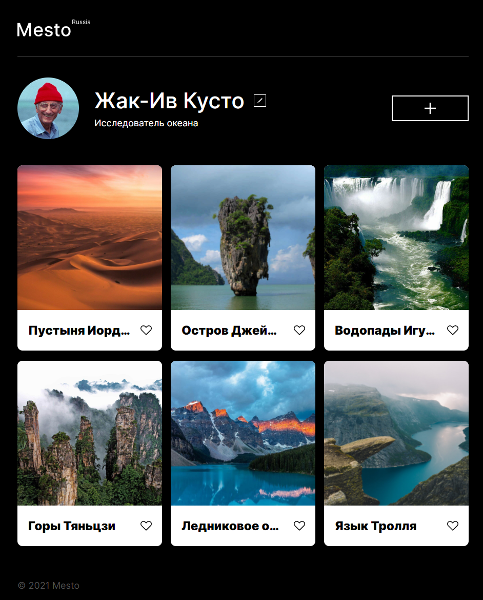

# [Проект: Mesto](https://kazankovstas.github.io/mesto/)

`Mesto` - сервис, представляющий из себя интерактивную страницу, позволяющую пользователям загружать фотографии, а также ставить им лайки.

---

### Технологии

- HTML
- CSS
- JavaScript
- БЭМ
- Flex Layout
- Grid Layout
- Адаптивная вёрстка

Сайт выполнен с применением таких технологий как HTML, CSS и JS, корректно отображается на экранах популярных форматов. При построении сеток использовались такие технологии как Flex Layout и Grid Layout. Файловая структура проекта оформлена по БЭМ Nested. Реализовано высплывающее окно формы редактирования данных пользователя с помощью JavaScript.

